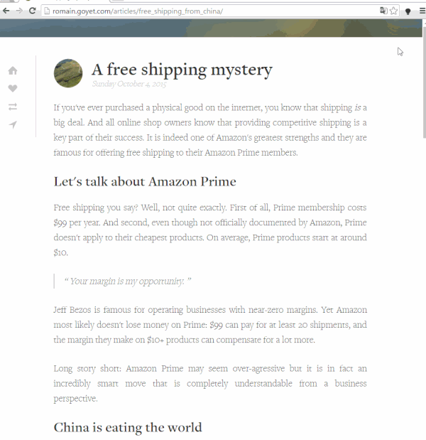

カラフル英語品詞分類
====

英語を品詞分類して色分けすることで、ウェブサイトを読みやすくするGoogle Chrome拡張です。

## Demo

## Usage
Chrome ウェブストアからインストールしてください。

[カラフル英語品詞分類](https://chrome.google.com/webstore/detail/%E3%82%AB%E3%83%A9%E3%83%95%E3%83%AB%E8%8B%B1%E8%AA%9E%E5%93%81%E8%A9%9E%E5%88%86%E9%A1%9E/doegjeglaefnalfehmeofnalobnbaakp)

## Requirement
品詞分類に[pos-js](https://github.com/dariusk/pos-js)を[browserify](http://browserify.org/)
で変換したものを使用しています。

## Licence
GNU LGPLv3

## Author

[drilldripper](https://github.com/DrillDripper)