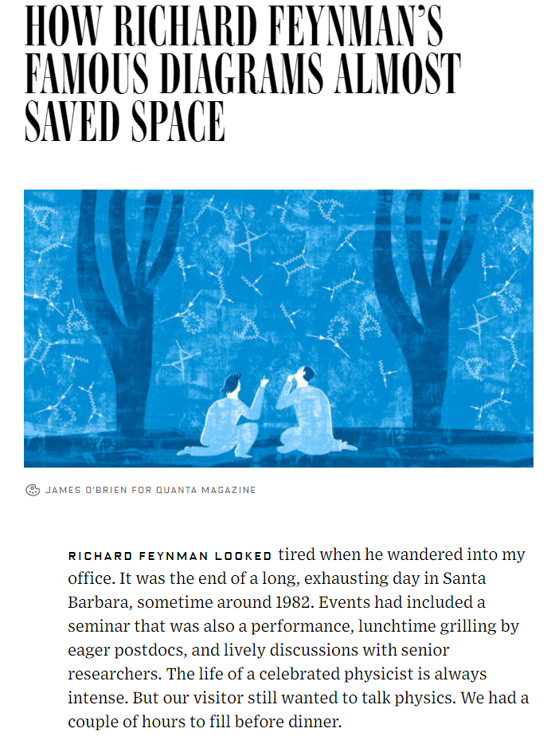
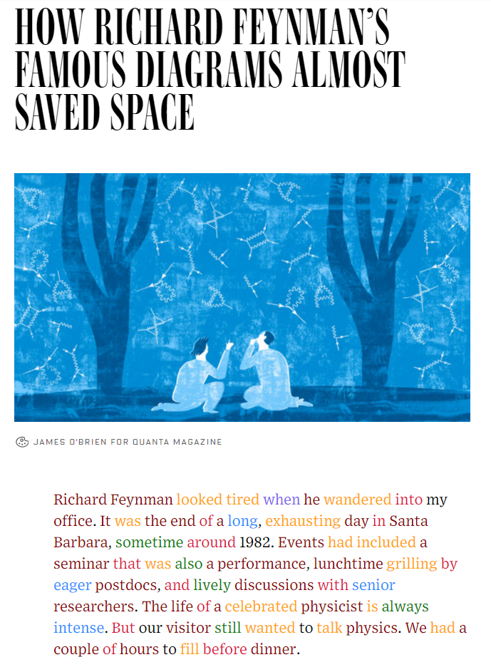

ColorPosTagger
====

Google Chromeで閲覧している英語のページを品詞分類し、色を付けることによって英語読解の補助を行います。

## Demo
以下のページに拡張機能を適応した例

http://www.wired.com/2016/07/feynman-diagrams-almost-saved-space/
- Before

- After

## Usage
拡張機能をインストールした後にアドレスバーにアイコンが表示されます。

アイコンをクリックすると品詞分類が行われ、ページに色がつきます。

## Install
本リポジトリをクローンし、拡張機能のデベロッパーモードで読み込んでください。

## Licence
MIT

## Author

[tcnksm](https://github.com/DrillDripper)